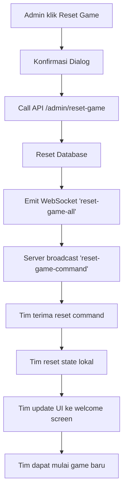

# Game Reset Feature - Tuna Adventure Game

## 🎯 **Fitur Reset Game**

Fitur ini memungkinkan admin untuk mereset permainan setelah dihentikan, sehingga tim dapat memulai permainan baru tanpa perlu refresh browser atau mengeluarkan peserta.

## 🔧 **Komponen yang Ditambahkan**

### 1. **API Endpoint** (`routes/admin.js` & `server-demo.js`)
```javascript
// POST /api/admin/reset-game
router.post("/reset-game", adminRateLimit, async (req, res) => {
  // Reset all teams to position 1 and score 0
  // Clear all team decisions
  // Return success response
});

// Demo version (server-demo.js)
app.post("/api/admin/reset-game", authenticateAdmin, (req, res) => {
  // Reset mock teams data
  // Clear mock decisions
  // Reset game state
  // Return success response
});
```

### 2. **Admin Panel UI** (`public/admin.html`)
```html
<button id="resetGameAllBtn" class="btn btn-warning btn-large">
    <i class="fas fa-redo"></i> Reset Game for All Teams
</button>
```

### 3. **Admin Panel Logic** (`public/admin.js`)
```javascript
async resetGameForAllTeams() {
  // Show confirmation dialog
  // Call API to reset game
  // Emit WebSocket command to all teams
  // Update admin state and UI
}
```

### 4. **Team Frontend Handler** (`public/app.js`)
```javascript
resetGameFromAdmin() {
  // Reset all game state variables
  // Clear localStorage
  // Update UI to welcome screen
  // Show success notification
}
```

### 5. **WebSocket Events** (`server.js` & `server-demo.js`)
```javascript
// Admin emits: 'reset-game-all'
// Server broadcasts: 'reset-game-command' to all teams
// Server notifies: 'game-reset' to admin room

// Demo version (server-demo.js)
socket.on('reset-game-all', () => {
  gameState = 'waiting';
  currentStep = 1;
  io.to('admin-room').emit('game-reset');
  io.emit('reset-game-command');
});
```

## 🚀 **Cara Menggunakan**

### **Untuk Admin:**
1. Buka Admin Panel
2. Pergi ke section "Game Control"
3. Klik tombol "Reset Game for All Teams"
4. Konfirmasi dialog yang muncul
5. Semua tim akan menerima notifikasi reset

### **Untuk Tim:**
1. Tim akan menerima notifikasi "Admin telah mereset permainan"
2. Game state akan direset ke kondisi awal
3. Tim dapat memulai permainan baru dengan tombol "Mulai Permainan"

## 🔄 **Alur Reset Game**



## 📊 **Data yang Direset**

### **Database:**
- `teams.current_position` → 1
- `teams.total_score` → 0
- `team_decisions` → Dihapus semua

### **Frontend State:**
- `gameState` → 'waiting'
- `isGameStarted` → false
- `isWaitingForAdmin` → false
- `currentScreen` → 'welcome-content'
- `currentScenarioPosition` → 1
- `currentScenario` → null
- `timeLeft` → 900

### **LocalStorage:**
- `tuna_game_state` → Dihapus
- `tuna_timer_state` → Dihapus

## 🛡️ **Keamanan**

- **Admin Authentication**: Hanya admin yang terautentikasi yang dapat reset game
- **Confirmation Dialog**: Admin harus konfirmasi sebelum reset
- **Rate Limiting**: API endpoint dilindungi rate limiting
- **Transaction**: Database reset menggunakan transaction untuk konsistensi

## ✅ **Keunggulan**

1. **User-Friendly**: Tim tidak perlu refresh browser atau logout
2. **Real-time**: Reset langsung tersinkronisasi ke semua tim
3. **Safe**: Konfirmasi dialog mencegah reset tidak sengaja
4. **Complete**: Reset semua data game state dan database
5. **Immediate**: Tim dapat langsung mulai game baru

## 🧪 **Testing**

### **Test Cases:**
1. ✅ Admin dapat reset game setelah game dihentikan
2. ✅ Semua tim menerima notifikasi reset
3. ✅ Game state tim direset ke kondisi awal
4. ✅ Tim dapat memulai game baru setelah reset
5. ✅ Database ter-reset dengan benar
6. ✅ LocalStorage ter-clear
7. ✅ UI update ke welcome screen

### **Test Scenario:**
1. Admin mulai game
2. Beberapa tim bermain dan submit decision
3. Admin hentikan game
4. Admin klik reset game
5. Semua tim dapat mulai game baru

## 🔧 **Maintenance**

- **Logging**: Semua reset action di-log
- **Monitoring**: Admin dapat monitor reset status
- **Error Handling**: Error handling untuk semua edge cases
- **Performance**: Reset menggunakan database transaction untuk performa optimal

## 📝 **Notes**

- Reset game akan menghapus **SEMUA** progress tim
- Tim tidak perlu logout/login setelah reset
- Game dapat di-reset kapan saja oleh admin
- Reset tidak mempengaruhi data tim (nama, password, dll)
- Hanya data game progress yang di-reset
