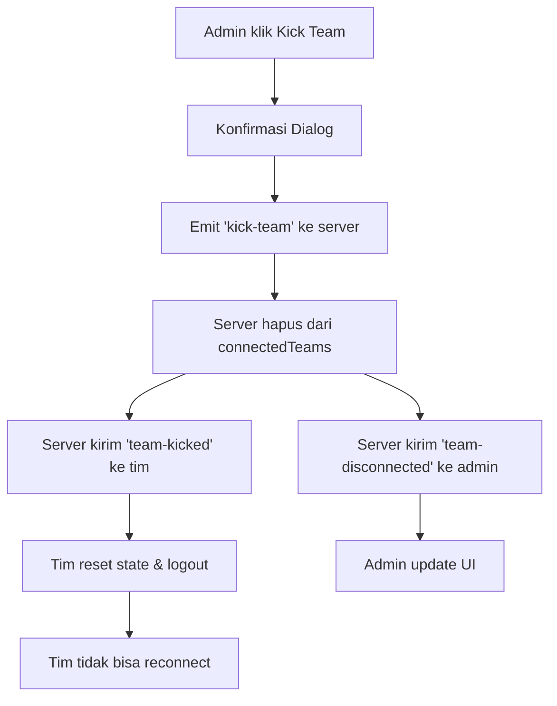

# Team Kick Fix - Tuna Adventure Game

## 🎯 **Masalah yang Diperbaiki**

Sebelumnya, ketika admin mengeluarkan (kick) tim dari permainan, tim tersebut masih tetap join di dalam game dan bisa reconnect otomatis. Ini menyebabkan masalah karena tim yang di-kick masih bisa bermain.

## 🔧 **Perbaikan yang Dilakukan**

### 1. **Server-side Improvements**

#### **A. Server Utama (`server.js`)**
```javascript
socket.on('kick-team', (data) => {
  const { teamId } = data;
  const teamSocketId = connectedTeams.get(teamId);
  if (teamSocketId) {
    // Get team name before deleting
    const teamName = io.sockets.sockets.get(teamSocketId)?.teamName || 'Unknown';
    
    // Send kick notification to team
    io.to(teamSocketId).emit('team-kicked');
    
    // Remove team from connected teams
    connectedTeams.delete(teamId);
    
    // Notify admins about team kick
    io.to('admin-room').emit('team-disconnected', {
      teamId: teamId,
      teamName: teamName
    });
    
    console.log(`👢 Team ${teamName} (${teamId}) kicked from game`);
  }
});
```

#### **B. Server Demo (`server-demo.js`)**
```javascript
socket.on('kick-team', (data) => {
  const { teamId } = data;
  const teamData = connectedTeams.get(teamId);
  if (teamData) {
    const teamName = teamData.teamName || 'Unknown';
    
    // Send kick notification to team
    io.to(teamData.socketId).emit('team-kicked');
    
    // Remove team from connected teams
    connectedTeams.delete(teamId);
    
    // Notify admins about team kick
    io.to('admin-room').emit('team-disconnected', {
      teamId: teamId,
      teamName: teamName
    });
    
    // Log the kick action
    serverLogger.team('kicked', teamId, teamName, {
      adminSocketId: socket.id,
      connectedTeamsCount: connectedTeams.size
    });
    
    console.log(`👢 Team ${teamName} (${teamId}) kicked from game`);
  }
});
```

### 2. **Frontend Improvements**

#### **A. Team Frontend (`public/app.js`)**
```javascript
this.socket.on('team-kicked', () => {
  console.log('👢 Team has been kicked by admin');
  this.showNotification(
    "Tim Anda telah dikeluarkan dari permainan oleh admin.",
    "warning"
  );
  
  // Reset join flag to prevent reconnection
  this.hasJoinedAsTeam = false;
  
  // Clear all game state
  this.clearGameState();
  localStorage.removeItem("tuna_game_state");
  localStorage.removeItem("tuna_timer_state");
  
  this.logout();
});
```

#### **B. Reconnect Prevention**
```javascript
// Reconnect team if socket reconnects
this.socket.on('reconnect', () => {
  console.log('🔌 Reconnected to server');
  
  // Only reconnect if team hasn't been kicked
  if (this.teamData && !this.hasJoinedAsTeam) {
    this.socket.emit('team-join', {
      teamId: this.teamData.id,
      teamName: this.teamData.teamName
    });
    this.hasJoinedAsTeam = true;
  }
});
```

#### **C. Admin Panel (`public/admin.js`)**
```javascript
kickTeam(teamId) {
  if (this.socket && confirm('Are you sure you want to kick this team? This will remove them from the game and they will need to rejoin.')) {
    this.socket.emit('kick-team', { teamId });
    this.showNotification('Team kicked from game', 'warning');
    
    // Remove team from connected teams immediately
    this.connectedTeams.delete(teamId);
    this.updateConnectedTeamsCount();
    this.updateRealTimeMonitoring();
  }
}
```

## ✅ **Fitur yang Diperbaiki**

### 1. **Proper Team Removal**
- ✅ Tim dihapus dari `connectedTeams` Map
- ✅ Admin mendapat notifikasi `team-disconnected`
- ✅ Tim tidak bisa reconnect otomatis

### 2. **State Management**
- ✅ `hasJoinedAsTeam` flag di-reset
- ✅ Game state di-clear
- ✅ LocalStorage di-clear
- ✅ Tim di-logout otomatis

### 3. **User Experience**
- ✅ Notifikasi yang jelas untuk tim
- ✅ Konfirmasi dialog yang lebih informatif
- ✅ Update UI admin panel secara real-time

### 4. **Logging & Monitoring**
- ✅ Log kick action di server
- ✅ Admin mendapat notifikasi real-time
- ✅ Connected teams count ter-update

## 🔄 **Alur Kick Team yang Diperbaiki**



## 🧪 **Testing**

### **Test Cases:**
1. ✅ Admin dapat kick tim dari game
2. ✅ Tim menerima notifikasi kick
3. ✅ Tim di-logout otomatis
4. ✅ Tim tidak bisa reconnect otomatis
5. ✅ Admin mendapat notifikasi tim disconnected
6. ✅ Connected teams count ter-update
7. ✅ Real-time monitoring ter-update

### **Test Scenario:**
1. Tim join game
2. Admin kick tim
3. Tim tidak bisa reconnect
4. Admin lihat tim hilang dari daftar
5. Tim harus login ulang untuk join

## 🛡️ **Keamanan**

- **Prevention**: Tim yang di-kick tidak bisa reconnect otomatis
- **State Cleanup**: Semua state di-clear saat kick
- **Confirmation**: Admin harus konfirmasi sebelum kick
- **Logging**: Semua kick action di-log

## 📝 **Notes**

- Tim yang di-kick harus login ulang untuk join game
- Admin dapat kick tim kapan saja
- Kick action tidak dapat di-undo
- Tim yang di-kick akan kehilangan semua progress lokal
- Server state tetap aman (database tidak terpengaruh)

## 🔧 **Maintenance**

- **Monitoring**: Admin dapat monitor tim yang di-kick
- **Logging**: Semua kick action tercatat di log
- **Error Handling**: Proper error handling untuk edge cases
- **Performance**: Efficient removal dari connected teams

Perbaikan ini memastikan bahwa ketika admin mengeluarkan tim dari permainan, tim tersebut benar-benar dikeluarkan dan tidak bisa masuk kembali tanpa login ulang.
